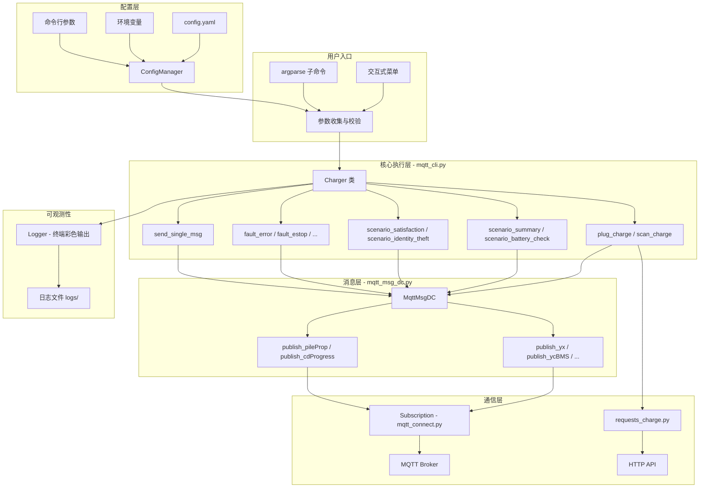
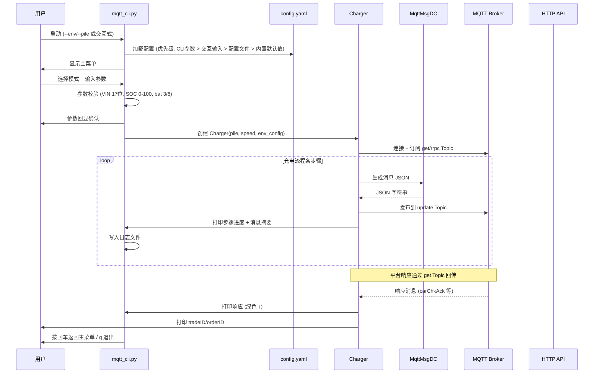

# 设计文档：MQTT 充电桩模拟 CLI 工具

## 概述

本设计文档描述 MQTT 充电桩模拟 CLI 工具的重构与扩展方案。基于现有的 `mqtt_cli.py`（Charger 类 + argparse）、`mqtt_connect.py`（Subscription MQTT 连接封装）、`mqtt_msg_dc.py`（MqttMsgDC 消息模板）三个核心文件，扩展为支持交互式菜单、多场景脚本、异常模拟、配置文件管理等 38 项需求的完整测试工具。

**核心设计约束：**
- 不新增 Python 源文件，所有逻辑集中在 `mqtt_cli.py` 和 `mqtt_msg_dc.py`
- 新增 `config.yaml`（参数配置）、`README.md`（使用文档）、`requirements.txt`（依赖清单）
- 保持与现有 `mqtt_connect.py` 和 `requests_charge.py` 的兼容

**设计目标：**
1. 交互式菜单 + argparse 子命令双模式并存
2. Charger 类扩展场景方法（充电小结、电池充检、满足度、身份盗用）和异常模拟方法
3. MqttMsgDC 扩展 `publish_cdProgress` 方法，`publish_ycBMS` 新增 `soc1`/`cdFlag` 可选参数
4. 支持 config.yaml 多环境配置、日志持久化、PyInstaller 打包

## 架构

### 整体架构



### 模块职责

| 文件 | 职责 | 修改范围 |
|------|------|----------|
| `mqtt_cli.py` | CLI 入口、交互式菜单、Charger 类（所有充电/场景/异常逻辑）、配置管理、日志、参数校验 | 大幅扩展 |
| `mqtt_msg_dc.py` | MQTT 消息 JSON 模板生成 | 新增 `publish_cdProgress`，扩展 `publish_ycBMS` |
| `mqtt_connect.py` | MQTT 连接、订阅、发布封装 | 不修改 |
| `requests_charge.py` | HTTP 请求工具 | 不修改 |
| `config.yaml` | 环境配置、默认参数、电池参数 | 新增 |
| `README.md` | 使用文档 | 新增 |
| `requirements.txt` | Python 依赖清单 | 新增 |

### 执行流程



## 组件与接口

### 1. ConfigManager（配置管理器）

在 `mqtt_cli.py` 中实现为函数或简单类，负责多层配置合并。

```python
class ConfigManager:
    """配置管理器：环境变量 > 命令行参数 > 交互输入 > config.yaml > 内置默认值"""
    
    def __init__(self, config_path="config.yaml"):
        self.config = self._load_config(config_path)
    
    def _load_config(self, path: str) -> dict:
        """加载 YAML 配置文件，不存在则返回空 dict"""
        ...
    
    def get_env_config(self, env_name: str) -> dict:
        """获取指定环境的 MQTT/HTTP 配置"""
        ...
    
    def get_defaults(self) -> dict:
        """获取默认参数"""
        ...
    
    def get_battery(self) -> dict:
        """获取电池/BMS 参数"""
        ...
    
    def generate_default_config(self, path: str):
        """生成默认配置文件模板"""
        ...
```

### 2. Charger 类扩展

现有 Charger 类扩展以下方法：

```python
class Charger:
    def __init__(self, pile, speed=2.0, env_config=None, cif=1, 
                 protocol_ver=119, pile_type="dc", logger=None):
        """
        扩展初始化：接收环境配置、协议版本、桩类型、日志器
        新增：self.get_topic（订阅平台响应用）
        新增：self.logger（日志持久化）
        """
    
    # === 现有方法（保留并扩展返回值） ===
    def plug_charge(self, vin, cif, soc, bsoc, esoc, bat, **kwargs) -> tuple[str, str]:
        """即插即充，返回 (tradeID, orderID)"""
    
    def scan_charge(self, vin, cif, uid, soc, bsoc, esoc, bat, **kwargs) -> tuple[str, str]:
        """扫码充电，返回 (tradeID, orderID)"""
    
    # === 场景脚本方法 ===
    def scenario_summary(self, vin, cif, soc, bsoc, esoc, bat, reason=114, **kwargs):
        """充电小结场景：完整充电流程 + 多条不同功率 ycBMS"""
    
    def scenario_battery_check(self, tradeID, check_id, vin, cif, result=0, interval=5, **kwargs):
        """电池充检场景：pileProp → ycBMS(cdFlag=2) → cdProgress(1→2→3→4→100)"""
    
    def scenario_satisfaction(self, vin, cif, mode="normal", bms_count=4, **kwargs):
        """满足度场景：不同 r_vol/r_cur/m_vol/m_cur 参数的 ycBMS"""
    
    def scenario_identity_theft(self, vin, cif, vsrc=0, bat=3, mode="normal", **kwargs):
        """身份盗用场景：carChk + starting(state=5) 带电池参数"""
    
    # === 异常模拟方法 ===
    def fault_error(self, cif, code="E07", repeat=1, interval=30):
        """故障模拟：yx error=1"""
    
    def fault_estop(self, cif, repeat=1, interval=30):
        """急停模拟：yx error=1, errcode=E05"""
    
    def fault_upgrading(self, cif, repeat=1, interval=30):
        """升级中模拟：yx status=6"""
    
    def fault_start_fail(self, cif, reason=1, errcode="", repeat=1, interval=30):
        """启动失败模拟：starting state=255"""
    
    def fault_gun_lock(self, cif, repeat=1, interval=30):
        """锁枪模拟：yx status=2, yx1=1, yx3=1, error=1, errcode=E71"""
    
    def fault_offline(self, cif, duration=30):
        """离线模拟：bootNoti → 断开 → 等待 → 重连 → olTrade"""
    
    # === 单条报文发送 ===
    def send_single_msg(self, msg_type, **params):
        """发送单条指定类型的 MQTT 报文"""
    
    # === 辅助方法 ===
    def _send_charging_bms_series(self, cif, tradeID, bsoc, esoc, count, interval, bms_params=None):
        """充电中阶段发送多条 SOC 递增的 ycBMS 报文"""
    
    def _pause_with_heartbeat(self, cif, duration, bms_interval=10, meas_interval=30, **kwargs):
        """暂停期间持续发送 yx/ycBMS/ycMeas 心跳"""
    
    def subscribe_responses(self):
        """订阅 get Topic 和 rrpc Topic，实时打印平台响应"""
    
    def disconnect(self):
        """断开 MQTT 连接"""
```

### 3. MqttMsgDC 扩展

```python
class MqttMsgDC:
    # 现有方法保持不变
    
    # 扩展 publish_ycBMS：新增 soc1, cdFlag 可选参数
    def publish_ycBMS(self, cif=1, tradeID=..., ..., soc1=None, cdFlag=None):
        """当 soc1/cdFlag 不为 None 时加入 JSON"""
    
    # 新增 publish_cdProgress
    def publish_cdProgress(self, cif=1, id="", type=1, state=1,
                           tradeID=None, vin=None, beginTime=None, endTime=None,
                           bp_r_cur=None, beginSoC=None, endSoC=None,
                           errcode=None, errmsg=None):
        """电池充检进度消息，state=100 时包含完整结果字段"""
```

### 4. 交互式菜单系统

在 `mqtt_cli.py` 的 `main()` 函数中实现：

```python
def main():
    # 1. argparse 解析（支持子命令 run/scenario/fault/send/multi/playbook）
    # 2. 如果无子命令 → 进入交互式菜单循环
    # 3. 菜单循环：显示主菜单 → 收集参数 → 校验 → 回显确认 → 执行 → 返回主菜单
    
def show_main_menu():
    """显示主菜单（含版本号）"""
    # [0] 重复上次操作
    # [1] 单次跑充电订单
    # [2] 批量跑充电订单
    # [3] 场景脚本
    # [4] 异常状态模拟
    # [5] 单条报文发送
    # [6] 多桩并行
    # [7] 执行编排脚本

def collect_params(mode: str, config: ConfigManager) -> dict:
    """交互式收集参数，提供默认值和说明"""

def validate_params(params: dict) -> tuple[bool, str]:
    """参数校验：VIN 17位、SOC 0-100、bat 3/6、pile 非空"""

def confirm_params(params: dict) -> bool:
    """参数回显确认"""
```

### 5. 日志系统

```python
class DualLogger:
    """同时输出到终端（彩色）和日志文件（纯文本）"""
    
    def __init__(self, log_dir="./logs/"):
        self.log_file = f"{log_dir}/{datetime.now().strftime('%Y%m%d_%H%M%S')}.log"
    
    def step(self, msg): ...      # 步骤信息（蓝色）
    def ok(self, msg): ...        # 成功信息（绿色）
    def send(self, label, payload): ...  # 发送消息（蓝色 ↑）
    def recv(self, label, payload): ...  # 接收消息（绿色 ↓）
    def error(self, msg): ...     # 错误信息（红色）
    def mask_sensitive(self, text): ...  # 密码脱敏
```

### 6. 多桩并行

```python
def run_multi_pile(pile_list: list, mode: str, params: dict, config: ConfigManager):
    """为每个桩创建独立 Charger 实例，使用 threading 并行执行"""
```

### 7. 场景编排

```python
def run_playbook(playbook_path: str, config: ConfigManager):
    """从 YAML 文件读取编排脚本，按顺序执行，支持 $prev.tradeID 变量引用"""
```


## 数据模型

### config.yaml 结构

```yaml
# MQTT 充电桩模拟 CLI 配置文件
environments:
  pre:
    mqtt_ip: "47.96.240.241"          # MQTT 服务器地址
    mqtt_port: 12883                   # MQTT 端口
    mqtt_user: "charge-mqtt"           # MQTT 用户名
    mqtt_pwd: ""                       # MQTT 密码（建议通过环境变量 MQTT_PWD_PRE 设置）
    public_pile: "XPeng_10002_Charge"  # 产品 Key
    url_equip: "https://thor.deploy-test.xiaopeng.com/api/xp-thor-asset/asset/equip/search"
    url_order: "https://xmart.deploy-test.xiaopeng.com/biz/v5/chargeOrder/chargeOrderV2"
    pile: "XPAC2017YS03240002"        # 默认桩编号
    vin: "TEST2K0Y5JI4P6BC7"          # 默认 VIN
    uid: "8102985"                     # 默认用户 UID
  test:
    mqtt_ip: "<test_ip>"              # MQTT 服务器地址
    mqtt_port: 12883
    mqtt_user: "charge-private-mqtt"
    mqtt_pwd: ""                       # 建议通过环境变量 MQTT_PWD_TEST 设置
    public_pile: "XPeng_TEST_Charge"
    url_equip: "http://thor.test.xiaopeng.local/api/xp-thor-asset/asset/equip/search"
    url_order: "https://10.0.13.28:8553/biz/v5/chargeOrder/chargeOrderV2"
    pile: "559847003"
    vin: "TESTNUYCXPKWVTIZF"
    uid: "1160057"

defaults:
  env: "pre"                # 默认环境
  pile: "XPAC2017YS03240002"
  cif: 1                    # 充电接口编号
  speed: 2.0                # 模拟速度倍数
  vin: "TEST2K0Y5JI4P6BC7"
  uid: "8102985"
  soc: 90
  bsoc: 20
  esoc: 90
  bat: 3                    # 电池类型 3=磷酸铁锂 6=三元锂
  rated_ah: 231.9           # 蓄电池额定容量
  rated_kwh: 74             # 蓄电池标定总能量
  pile_type: "dc"           # 桩类型 dc/ac
  protocol_ver: 119         # 协议版本号

battery:
  maxAllowTemp: 105
  maxAllowVol: 427.6
  cellMaxAllowVol: 4.38
  maxAllowCur: 376.1
  ratedVol: 345.6
  batVol: 336.0
  maxOutVol: 500.0
  minOutVol: 200.0
  maxOutCur: 200.0
  minOutCur: 0.0
  bhmMaxAllowVol: 427.6
```

### .last_run.json 结构

```json
{
  "mode": "plug_charge",
  "env": "pre",
  "pile": "XPAC2017YS03240002",
  "vin": "TEST2K0Y5JI4P6BC7",
  "cif": 1,
  "soc": 90,
  "bsoc": 20,
  "esoc": 90,
  "bat": 3,
  "speed": 2.0,
  "loop": 1,
  "extra_params": {},
  "timestamp": "2024-01-15T10:30:00",
  "tradeID": "2401151030",
  "orderID": ""
}
```

### 场景编排 YAML 结构

```yaml
name: "充电+充检完整流程"
steps:
  - action: run_plug
    params: { vin: "TEST2K0Y5JI4P6BC7", bsoc: 20, esoc: 90 }
  - action: scenario_battery_check
    params: { tradeID: "$prev.tradeID", vin: "$prev.vin", result: success }
  - action: fault_error
    params: { code: "E07" }
```

### 参数优先级模型

```
命令行参数 (--pile, --vin, ...)
    ↓ 覆盖
交互式输入 (input 提示)
    ↓ 覆盖
config.yaml 配置文件
    ↓ 覆盖
内置默认值 (代码中硬编码)
```

敏感信息优先级：
```
环境变量 (MQTT_PWD_PRE, MQTT_PWD_TEST)
    ↓ 覆盖
config.yaml 中的值
    ↓ 覆盖
内置默认值
```

### MQTT Topic 格式

- 上报 Topic: `/{productKey}/{deviceName}/update`
- 订阅 Topic: `/{productKey}/{deviceName}/get`
- RRPC Topic: `/{productKey}/{deviceName}/rrpc/request/+`

### 消息类型枚举

| 消息类型 | msg 字段 | 方向 | 说明 |
|----------|----------|------|------|
| yx | "yx" | 上报 | 遥信数据（桩状态） |
| ycBMS | "ycBMS" | 上报 | BMS 电池数据 |
| ycMeas | "ycMeas" | 上报 | 计量数据 |
| ycAnalog | "ycAnalog" | 上报 | 采集数据 |
| starting | "starting" | 上报 | 启动状态 |
| chargEnd | "chargEnd" | 上报 | 充电结束 |
| trade | "trade" | 上报 | 交易上传 |
| olTrade | "olTrade" | 上报 | 离线交易 |
| carChk | "carChk" | 上报 | 车辆验证 |
| bootNoti | "bootNoti" | 上报 | 启动通知 |
| pileProp | "pileProp" | 上报 | 桩属性 |
| cdProgress | "cdProgress" | 上报 | 充检进度（v1.19） |

